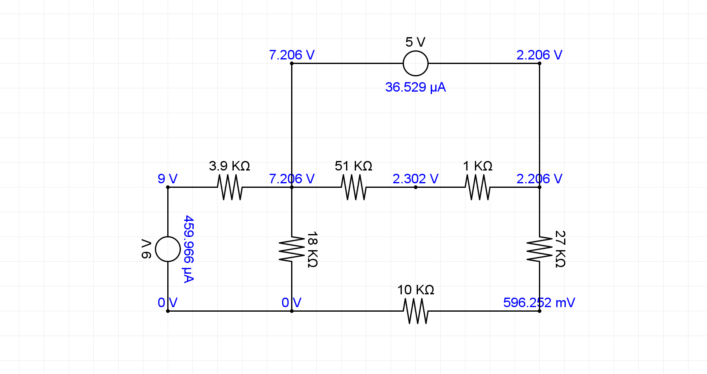

# CircuitSim

**CircuitSim** es un simulador interactivo de circuitos eléctricos desarrollado en Java. Actualmente se encuentra en una etapa temprana de desarrollo: permite visualizar el circuito, reacomodarlo libremente y calcular los voltajes en los nodos a través del método de Análisis Nodal Modificado (MNA).

<p align="center">
  
</p>

---

## Tabla de Contenidos

- [Introducción](#introducción)
- [Características](#características)
- [Requisitos del Sistema](#requisitos-del-sistema)
- [Instalación](#instalación)
- [Cómo cargar un archivo](#cómo-cargar-un-archivo)
- [Detalle del Layout del Circuito](#detalle-del-layout-del-circuito)
- [Contribuyendo](#contribuyendo)
- [Licencia](#licencia)
- [Créditos](#créditos)

---

## Introducción

CircuitSim permite visualizar y reacomodar circuitos eléctricos de forma interactiva, así como calcular los voltajes en los nodos mediante el método de Análisis Nodal Modificado (MNA).  
Es una versión temprana del proyecto enfocada en el análisis visual estático, sin simulación dinámica ni interacción con componentes.

---

## Características

- Interfaz gráfica de usuario interactiva.
- Soporte de componentes: resistencias y fuentes de voltaje.
- Análisis automático usando matrices MNA.
- Visualización gráfica personalizada.
- Exportación del circuito como imagen PNG.
- Depuración detallada en consola.

---

## Requisitos del Sistema

- **JDK (Java Development Kit)** versión 11 o superior
- Un entorno de desarrollo Java como **IntelliJ IDEA**, **Eclipse** o **NetBeans**.

---

## Instalación

1. Clona este repositorio:

```bash
git clone https://github.com/Ranphe/CircuitSim.git
```

2. Importa el proyecto en tu IDE preferido.

3. Compila y ejecuta el proyecto:
- Navega a la clase principal `Main`.
- Ejecuta la aplicación para iniciar el simulador.

## Cómo cargar un archivo

1. Prepara un archivo de texto plano (`.txt`) con el circuito en formato:

```
R 1 2 3.9KΩ
C 2 2B 0
R 2 3 51KΩ
R 2 0 18KΩ
R 2B 4 12KΩ
R 3 4B 1KΩ
R 0 5 10KΩ
C 4 4B 0
R 4B 5 27KΩ
C 0 0B 0
F 1 0B 9V
```

2. Desde la interfaz gráfica:
   - Selecciona el menú **Opciones → Cargar**.
   - Navega y selecciona tu archivo `.txt`.
   - El circuito será cargado y visualizado automáticamente.

---

## Detalle del Layout del Circuito

Este simulador implementa un algoritmo avanzado para asignar posiciones iniciales claras y ordenadas a los nodos del circuito usando **Breadth-First Search (BFS)**. El algoritmo garantiza una distribución visual óptima según las siguientes reglas:

### Reglas del Algoritmo:

- **Nodo Origen** se coloca en `(0,0)`.
- Se realiza un recorrido BFS nivel por nivel.
- Se asignan posiciones a los nodos hijos priorizando la distancia creciente hacia el nodo tierra.
- Se busca espacio disponible girando en sentido antihorario cuando las posiciones están ocupadas.
- Las posiciones se separan uniformemente por 300 píxeles para claridad visual.

Este método asegura una representación visual estructurada y coherente del circuito eléctrico.

---

## Contribuyendo

Las contribuciones son siempre bienvenidas. Para colaborar:

1. Haz un **fork** del repositorio.
2. Crea una rama (`git checkout -b feature/nueva-funcionalidad`).
3. Realiza tus cambios y haz commit (`git commit -m "Añadida nueva funcionalidad"`).
4. Sube tu rama (`git push origin feature/nueva-funcionalidad`).
5. Abre un **Pull Request** explicando claramente tus cambios.

¡Gracias por contribuir al proyecto!

---

## Licencia

Este proyecto está licenciado bajo los términos de la Licencia Pública General Affero de GNU v3.0 (**AGPL-3.0**). Consulta el archivo [LICENSE](LICENSE.md) para más detalles.

---

## Créditos

Desarrollado por **[Ranphe](https://github.com/Ranphe)**.

Creado por y para la comunidad educativa.
